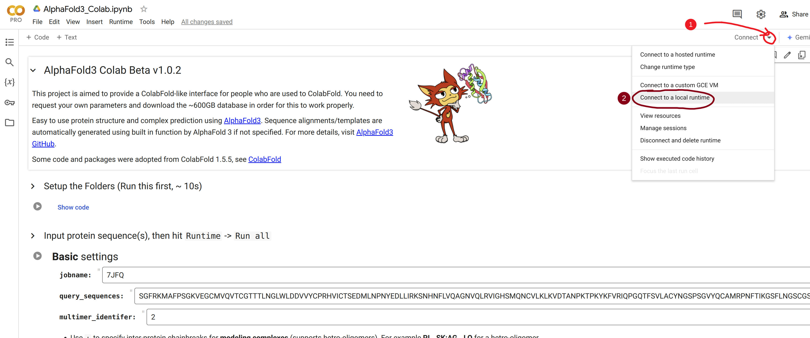
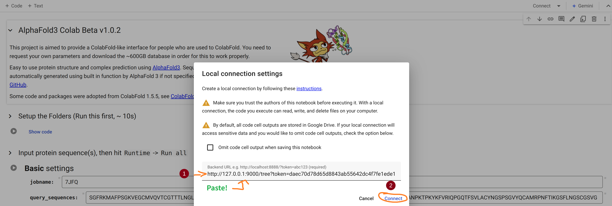

# Installation and Running Your First Prediction

You will need a machine running Linux; AlphaFold 3 does not support other
operating systems. Full installation requires up to 1 TB of disk space to keep
genetic databases (SSD storage is recommended) and an NVIDIA GPU with Compute
Capability 8.0 or greater (GPUs with more memory can predict larger protein
structures). We have verified that inputs with up to 5,120 tokens can fit on a
single NVIDIA A100 80 GB, or a single NVIDIA H100 80 GB. We have verified
numerical accuracy on both NVIDIA A100 and H100 GPUs.

Especially for long targets, the genetic search stage can consume a lot of RAM –
we recommend running with at least 64 GB of RAM.

We provide installation instructions for a machine with an NVIDIA A100 80 GB GPU
and a clean Ubuntu 22.04 LTS installation, and expect that these instructions
should aid others with different setups. If you are installing locally outside
of a Docker container, please ensure CUDA, cuDNN, and JAX are correctly
installed; the
[JAX installation documentation](https://jax.readthedocs.io/en/latest/installation.html#nvidia-gpu)
is a useful reference for this case.

The instructions provided below describe how to:

1.  Provision a machine on GCP.
1.  Install Docker.
1.  Install NVIDIA drivers for an A100.
1.  Obtain genetic databases.
1.  Obtain model parameters.
1.  Build the AlphaFold 3 Docker container or Singularity image.

## Provisioning a Machine

Clean Ubuntu images are available on Google Cloud, AWS, Azure, and other major
platforms.

We first provisioned a new machine in Google Cloud Platform using the following
command. We were using a Google Cloud project that was already set up.

*   We recommend using `--machine-type a2-ultragpu-1g` but feel free to use
    `--machine-type a2-highgpu-1g` for smaller predictions.
*   If desired, replace `--zone us-central1-a` with a zone that has quota for
    the machine you have selected. See
    [gpu-regions-zones](https://cloud.google.com/compute/docs/gpus/gpu-regions-zones).

```sh
gcloud compute instances create alphafold3 \
    --machine-type a2-ultragpu-1g \
    --zone us-central1-a \
    --image-family ubuntu-2204-lts \
    --image-project ubuntu-os-cloud \
    --maintenance-policy TERMINATE \
    --boot-disk-size 1000 \
    --boot-disk-type pd-balanced
```

This provisions a bare Ubuntu 22.04 LTS image on an
[A2 Ultra](https://cloud.google.com/compute/docs/accelerator-optimized-machines#a2-vms)
machine with 12 CPUs, 170 GB RAM, 1 TB disk and NVIDIA A100 80 GB GPU attached.
We verified the following installation steps from this point.

## Installing Docker

These instructions are for rootless Docker.

### Installing Docker on Host

Note these instructions only apply to Ubuntu 22.04 LTS images, see above.

Add Docker's official GPG key. Official Docker instructions are
[here](https://docs.docker.com/engine/install/ubuntu/#install-using-the-repository).
The commands we ran are:

```sh
sudo apt-get update
sudo apt-get install ca-certificates curl
sudo install -m 0755 -d /etc/apt/keyrings
sudo curl -fsSL https://download.docker.com/linux/ubuntu/gpg -o /etc/apt/keyrings/docker.asc
sudo chmod a+r /etc/apt/keyrings/docker.asc
```

Add the repository to apt sources:

```sh
echo \
  "deb [arch=$(dpkg --print-architecture) signed-by=/etc/apt/keyrings/docker.asc] https://download.docker.com/linux/ubuntu \
  $(. /etc/os-release && echo "$VERSION_CODENAME") stable" | \
  sudo tee /etc/apt/sources.list.d/docker.list > /dev/null
sudo apt-get update
sudo apt-get install -y docker-ce docker-ce-cli containerd.io docker-buildx-plugin docker-compose-plugin
sudo docker run hello-world
```

### Enabling Rootless Docker

Official Docker instructions are
[here](https://docs.docker.com/engine/security/rootless/#distribution-specific-hint).
The commands we ran are:

```sh
sudo apt-get install -y uidmap systemd-container

sudo machinectl shell $(whoami)@ /bin/bash -c 'dockerd-rootless-setuptool.sh install && sudo loginctl enable-linger $(whoami) && DOCKER_HOST=unix:///run/user/1001/docker.sock docker context use rootless'
```

## Installing GPU Support

### Installing NVIDIA Drivers

Official Ubuntu instructions are
[here](https://documentation.ubuntu.com/server/how-to/graphics/install-nvidia-drivers/).
The commands we ran are:

```sh
sudo apt-get -y install alsa-utils ubuntu-drivers-common
sudo ubuntu-drivers install

sudo nvidia-smi --gpu-reset

nvidia-smi  # Check that the drivers are installed.
```

Accept "Pending kernel upgrade" dialog if it appears.

You will need to reboot the instance with `sudo reboot now` to reset the GPU if
you see the following warning:

```text
NVIDIA-SMI has failed because it couldn't communicate with the NVIDIA driver.
Make sure that the latest NVIDIA driver is installed and running.
```

Proceed only if `nvidia-smi` has a sensible output.

### Installing NVIDIA Support for Docker

Official NVIDIA instructions are
[here](https://docs.nvidia.com/datacenter/cloud-native/container-toolkit/install-guide.html).
The commands we ran are:

```sh
curl -fsSL https://nvidia.github.io/libnvidia-container/gpgkey | sudo gpg --dearmor -o /usr/share/keyrings/nvidia-container-toolkit-keyring.gpg \
  && curl -s -L https://nvidia.github.io/libnvidia-container/stable/deb/nvidia-container-toolkit.list | \
    sed 's#deb https://#deb [signed-by=/usr/share/keyrings/nvidia-container-toolkit-keyring.gpg] https://#g' | \
    sudo tee /etc/apt/sources.list.d/nvidia-container-toolkit.list
sudo apt-get update
sudo apt-get install -y nvidia-container-toolkit
nvidia-ctk runtime configure --runtime=docker --config=$HOME/.config/docker/daemon.json
systemctl --user restart docker
sudo nvidia-ctk config --set nvidia-container-cli.no-cgroups --in-place
```

Check that your container can see the GPU:

```sh
docker run --rm --gpus all nvidia/cuda:12.6.0-base-ubuntu22.04 nvidia-smi
```

The output should look similar to this:

```text
Mon Nov  11 12:00:00 2024
+-----------------------------------------------------------------------------------------+
| NVIDIA-SMI 550.120                Driver Version: 550.120        CUDA Version: 12.6     |
|-----------------------------------------+------------------------+----------------------+
| GPU  Name                 Persistence-M | Bus-Id          Disp.A | Volatile Uncorr. ECC |
| Fan  Temp   Perf          Pwr:Usage/Cap |           Memory-Usage | GPU-Util  Compute M. |
|                                         |                        |               MIG M. |
|=========================================+========================+======================|
|   0  NVIDIA A100-SXM4-80GB          Off |   00000000:00:05.0 Off |                    0 |
| N/A   34C    P0             51W /  400W |       1MiB /  81920MiB |      0%      Default |
|                                         |                        |             Disabled |
+-----------------------------------------+------------------------+----------------------+

+-----------------------------------------------------------------------------------------+
| Processes:                                                                              |
|  GPU   GI   CI        PID   Type   Process name                              GPU Memory |
|        ID   ID                                                               Usage      |
|=========================================================================================|
|  No running processes found                                                             |
+-----------------------------------------------------------------------------------------+
```

## Obtaining AlphaFold 3 Source Code

You will need to have `git` installed to download the AlphaFold 3 repository:

```sh
git clone https://github.com/google-deepmind/alphafold3.git
```

## Obtaining Genetic Databases

This step requires `wget` and `zstd` to be installed on your machine.

AlphaFold 3 needs multiple genetic (sequence) protein and RNA databases to run:

*   [BFD small](https://bfd.mmseqs.com/)
*   [MGnify](https://www.ebi.ac.uk/metagenomics/)
*   [PDB](https://www.rcsb.org/) (structures in the mmCIF format)
*   [PDB seqres](https://www.rcsb.org/)
*   [UniProt](https://www.uniprot.org/uniprot/)
*   [UniRef90](https://www.uniprot.org/help/uniref)
*   [NT](https://www.ncbi.nlm.nih.gov/nucleotide/)
*   [RFam](https://rfam.org/)
*   [RNACentral](https://rnacentral.org/)

We provide a bash script `fetch_databases.sh` that can be used to download and
set up all of these databases. This process takes around 45 minutes when not
installing on local SSD. We recommend running the following in a `screen` or
`tmux` session as downloading and decompressing the databases takes some time.

```sh
cd alphafold3  # Navigate to the directory with cloned AlphaFold 3 repository.
./fetch_databases.sh <DB_DIR>
```

This script downloads the databases from a mirror hosted on GCS, with all
versions being the same as used in the AlphaFold 3 paper.

:ledger: **Note: The download directory `<DB_DIR>` should *not* be a
subdirectory in the AlphaFold 3 repository directory.** If it is, the Docker
build will be slow as the large databases will be copied during the image
creation.

:ledger: **Note: The total download size for the full databases is around 252 GB
and the total size when unzipped is 630 GB. Please make sure you have sufficient
hard drive space, bandwidth, and time to download. We recommend using an SSD for
better genetic search performance.**

:ledger: **Note: If the download directory and datasets don't have full read and
write permissions, it can cause errors with the MSA tools, with opaque
(external) error messages. Please ensure the required permissions are applied,
e.g. with the `sudo chmod 755 --recursive <DB_DIR>` command.**

Once the script has finished, you should have the following directory structure:

```sh
mmcif_files/  # Directory containing ~200k PDB mmCIF files.
bfd-first_non_consensus_sequences.fasta
mgy_clusters_2022_05.fa
nt_rna_2023_02_23_clust_seq_id_90_cov_80_rep_seq.fasta
pdb_seqres_2022_09_28.fasta
rfam_14_9_clust_seq_id_90_cov_80_rep_seq.fasta
rnacentral_active_seq_id_90_cov_80_linclust.fasta
uniprot_all_2021_04.fa
uniref90_2022_05.fa
```

Optionally, after the script finishes, you may want copy databases to an SSD.
You can use theses two scripts:

*   `src/scripts/gcp_mount_ssd.sh <SSD_MOUNT_PATH>` Mounts and formats an
    unmounted GCP SSD drive. It will skip the either step if the disk is either
    already formatted or already mounted. The default `<SSD_MOUNT_PATH>` is
    `/mnt/disks/ssd`.
*   `src/scripts/copy_to_ssd.sh <DB_DIR> <SSD_DB_DIR>` this will copy as many
    files that it can fit on to the SSD. The default `<DATABASE_DIR>` is
    `$HOME/public_databases` and the default `<SSD_DB_DIR>` is
    `/mnt/disks/ssd/public_databases`.

## Obtaining Model Parameters

To request access to the AlphaFold 3 model parameters, please complete
[this form](https://forms.gle/svvpY4u2jsHEwWYS6). Access will be granted at
Google DeepMind’s sole discretion. We will aim to respond to requests within 2–3
business days. You may only use AlphaFold 3 model parameters if received
directly from Google. Use is subject to these
[terms of use](https://github.com/google-deepmind/alphafold3/blob/main/WEIGHTS_TERMS_OF_USE.md).

## Building the Docker Container That Will Run AlphaFold 3

Then, build the Docker container. This builds a container with all the right
python dependencies:

```sh
docker build -t alphafold3 -f docker/Dockerfile .
```

You can now run AlphaFold 3!

```sh
docker run -it \
    --volume $HOME/af_input:/root/af_input \
    --volume $HOME/af_output:/root/af_output \
    --volume <MODEL_PARAMETERS_DIR>:/root/models \
    --volume <DATABASES_DIR>:/root/public_databases \
    --gpus=all \
    -p 127.0.0.1:9000:9000 \
    --name AlphaFold3 \
    alphafold3 
```
Note: <DATABASES_DIR> and <MODEL_PARAMETERS_DIR> are the location where your 
AlphaFold 3 model and the 600GB database is located.

:ledger: **Note: In the example above the databases have been placed on the
persistent disk, which is slow.** If you want better genetic and template search
performance, make sure all databases are placed on a local SSD.

If you get an error like the following, make sure the models and data are in the
paths (flags named `--volume` above) in the correct locations.

```
docker: Error response from daemon: error while creating mount source path '/srv/alphafold3_data/models': mkdir /srv/alphafold3_data/models: permission denied.
```
## Start and Connect Google Colab to your local container

Once you started AlphaFold 3, you will see the following printed in your terminal: 

```sh

[I 2024-11-17 22:51:27.848 ServerApp] jupyterlab | extension was successfully loaded.
[I 2024-11-17 22:51:27.849 ServerApp] notebook | extension was successfully loaded.
[I 2024-11-17 22:51:27.849 ServerApp] Serving notebooks from local directory: /app/alphafold
[I 2024-11-17 22:51:27.849 ServerApp] Jupyter Server 2.14.2 is running at:
[I 2024-11-17 22:51:27.849 ServerApp] http://51204ec36658:9000/tree?token=daec70d78d65d8843ab55642dc4f7fe1ede1ef4a687e042f
[I 2024-11-17 22:51:27.849 ServerApp]     http://127.0.0.1:9000/tree?token=daec70d78d65d8843ab55642dc4f7fe1ede1ef4a687e042f
[I 2024-11-17 22:51:27.849 ServerApp] Use Control-C to stop this server and shut down all kernels (twice to skip confirmation).

```
You need to copy the link starting with "http://127.0.0.1:9000/", make sure you copied everything including the token at the end.
Open this Colab Notebook and execute the following in the figures:
[Google Colab](https://colab.research.google.com/drive/1wTvTq_kYpBThaWg3oUNUIMFp5Gw8Se2M?usp=sharing).





Everything should be all set, happy folding!

In the future, you can use your container again by doing:

```sh
docker run -i AlphaFold3
```

To access your machine with AF3 installed remotely, when connecting to your machine use ssh:

```sh
ssh <IP> -l <Username> -L 9000:localhost:9000
```
